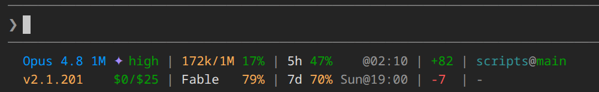

# Claude Code Status Line

A custom status line for [Claude Code](https://claude.com/claude-code) that displays the model, reasoning effort, token usage, rate limits, reset times, and the installed CLI version in two compact, aligned lines. It runs as an external command, so it does not slow down Claude Code or consume any extra tokens.

> **Actively maintained.** This is an independent continuation of [daniel3303/ClaudeCodeStatusLine](https://github.com/daniel3303/ClaudeCodeStatusLine), maintained by [@chrisdpurcell](https://github.com/chrisdpurcell). See the [changelog](CHANGELOG.md) for what's new. **To get notified of updates:** click **Watch → Custom → Releases** at the top of the repo — or leave the built-in update check on, which flags a new release in the status line itself.

## Screenshot



Both lines render below the Claude Code input box; the pipes stay aligned as the values change.

## What it shows

The status line is a two-line grid. Pipes align vertically, each column sizing itself to the wider of its two cells:

```text
Opus 4.8 1M ✦ high | 435k/1M 44% | 5h  4%    @16:40 | +12 | hw-radar@main:my-worktree
v2.1.198    $0/$25 | Fable   79% | 7d 12% Sun@19:00 | -3  | ~/projects/hw-radar
```

(The token and Fable percentages right-align to column 2's edge so they stack vertically, and the effort word and extra-usage dollars right-align to column 1's edge, so `effort` sits flush over the dollars regardless of how wide the credits figure grows.)

| Cell | Position | Description |
| --- | --- | --- |
| **Model + Effort** | row 1, col 1 | Model name (a `(1M context)` suffix collapses to `1M`), a `✦` when extended thinking is enabled, and the reasoning effort level (`low`, `med`, `high`, `xhigh`, `max`). The effort word right-aligns to the column edge, stacking over the extra-usage dollars below it |
| **Tokens** | row 1, col 2 | Used / total context-window tokens and % used (the % right-aligns to the column edge, stacking under the Fable %) |
| **5h** | row 1, col 3 | 5-hour rate-limit usage percentage and reset time |
| **Lines +/−** | col 4 | Unstaged line changes in tracked files, `+added` stacked over `-removed` (staged and untracked changes aren't counted). The column appears only while the tree is dirty |
| **CWD@Branch:Worktree** | row 1, last | Current folder name and git branch; in `--worktree` sessions the worktree name follows the branch as `@branch:worktree`. Omitted (with its row-2 path partner) when Claude Code supplies no working directory |
| **Version + Extra** | row 2, col 1 | Installed Claude Code CLI version (or `-` when unknown), with extra-usage credits `$spent/$limit` right-aligned to the column edge whenever extra usage is enabled (whole dollars drop the cents: `$0/$25`) |
| **Fable** | row 2, col 2 | Fable-scoped weekly usage percentage (right-aligned to the column edge, under the token %), color-coded like the other limits. When no Fable weekly limit is active — e.g. accounts without Fable, or while Fable is off subscription plans (from 2026-07-07) pending its return — the `Fable` label stays and the percentage becomes a `😢` rather than vanishing, holding the column until Fable comes back |
| **7d** | row 2, col 3 | 7-day rate-limit usage percentage and reset time |
| **Path** | row 2, last | Full working-directory path with your home directory collapsed to `~` (e.g. `~/projects/hw-radar`); shares the trailing column with row 1's folder name and omits with it when there is no working directory |
| **Update** | line 3 | Appears when a new release is available (checked every 24h) |

Within the 5h/7d column the percentages right-align and the `@` reset markers stack, so the two rows read as one table.

Usage percentages are floored and color-coded: green (&lt;50%) → yellow (≥50%) → orange (≥70%) → red (≥90%).

## Installation

Ask Claude Code:

> Clone <https://github.com/chrisdpurcell/ClaudeCodeStatusLine> to `~/.claude/statusline/` (or `%USERPROFILE%\.claude\statusline\` on Windows) and configure it as my status bar by following its INSTALL.md.

Claude will clone the repo to that path, choose the Bash, PowerShell, or Python implementation, and update `settings.json`. The Python option uses the extensionless `statuslinepy` executable and requires `python3` 3.10+ with its pinned Rich and Humanize dependencies. Full step-by-step instructions Claude follows live in [INSTALL.md](INSTALL.md).

Restart Claude Code after Claude saves the configuration.

### Updating

When the status line shows a new release is available, ask Claude:

> Find my installed status bar and update it.

Or update it yourself:

```bash
git -C ~/.claude/statusline pull --ff-only origin main
```

No `settings.json` changes are needed — the path stays valid across `main` updates.

## Requirements

- Claude Code with OAuth authentication (Pro/Max subscription for rate-limit and extra-usage data)
- `git` in `PATH` to clone or update (optional at runtime, where it enables `@branch` annotations)
- Bash implementation (macOS / Linux): `jq` and `curl`
- Python alternative: `curl` and `python3` 3.10+ with the packages pinned in [`requirements.txt`](requirements.txt); `jq` is not required
- Windows: PowerShell 5.1+ (default on Windows 10/11)

## Caching

Usage data from the Anthropic API is cached for 60 seconds at `statusline-usage-cache-<hash>.json`, under `${XDG_RUNTIME_DIR:-/tmp}/claude/` on Linux/macOS (a per-user runtime directory when available, falling back to `/tmp`) or `%TEMP%\claude\...` on Windows. A small fetch-stamp file alongside it tracks the 60-second throttle independently of cache writes. Release checks are cached for 24 hours. All caches are shared across concurrent Claude Code instances to avoid rate limits.

## Update Notifications

The status line checks GitHub for new releases once every 24 hours via an outbound HTTP request to `api.github.com`. When a newer version is available, a second line appears below the status line. The check fails silently if the API is unreachable.

To disable the update check entirely (no network calls), set it to the exact string `false`:

```bash
export STATUSLINE_CHECK_UPDATES=false
```

Any other value, including `0` or `False`, leaves the check enabled.

## Changelog

See [CHANGELOG.md](CHANGELOG.md) for release history.

## License

MIT — see [LICENSE](LICENSE).

## Credits

Originally created by **Daniel Oliveira** ([@daniel3303](https://github.com/daniel3303/ClaudeCodeStatusLine)). This repository is an independent continuation, now maintained by **Chris Purcell** ([@chrisdpurcell](https://github.com/chrisdpurcell)). Thanks to Daniel for the original work.

[](https://danielapoliveira.com/) [](https://x.com/daniel_not_nerd) [](https://www.linkedin.com/in/daniel-ap-oliveira/)
